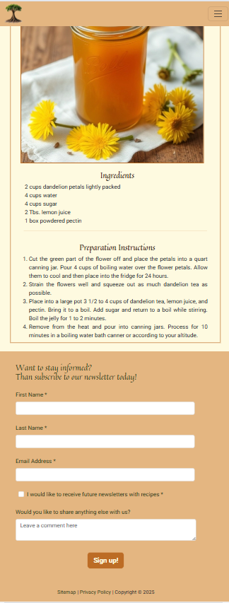
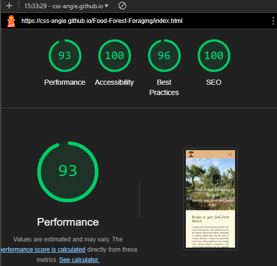
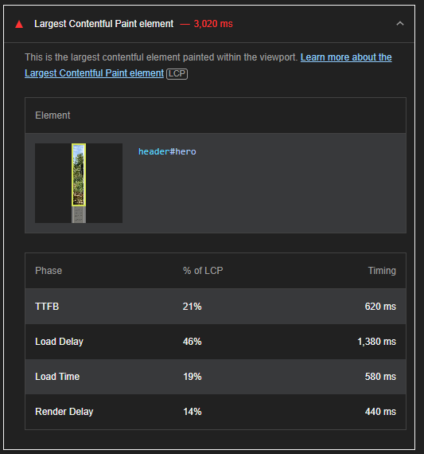
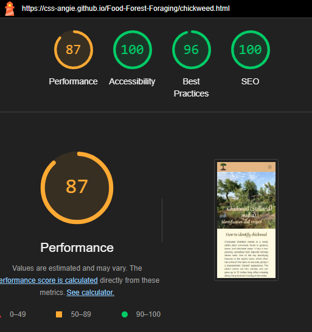
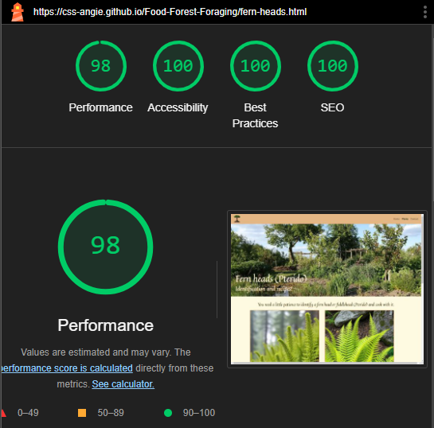

# **_Food Forest Foraging Recipes - Portfolio Project 1_**

This document contains all the issues necessary to create and develop a website in HTML5 and CSS3 for the website: <a href="https://css-angie.github.io/Food-Forest-Foraging/" rel="noopener" target="_blank">Food Forest Foraging Recipes</a>. The website is a part of the course “Full Stack Software Development” at Code Institute and showcases the knowledge I have gained so far.

# Table of content

- [The objective of the website](#the-objective-of-the-website) 1
- [The UX part of creation](#the-ux-part-of-creation)
  - [Creating user stories](#creating-user-stories) 
  - [Designing the layout and structure](#designing-the-layout-and-structure)
  - [Colour Palette](#colour-palette)
  - [Typography](#typography)
  - [Images](#images)
- [Basic Setup](#basic-setup)
  - [Setup of the repository](#setup-of-the-repository)
  - [External sources](#external-sources)
- [Features](#features)
  - [Generic features](#generic-features)
    - [Responsive design](#responsive-design)
    - [Favicon](#favicon)
    - [Navigation](#navigation)
    - [Hero section](#hero-section)
    - [Footer](#footer)
  - [Homepage](#homepage)
    - [Main section](#main-section)
  - [Plant page](#plant-page)
  - [Contact page](#contact-page)
  - [Thank you page](#thank-you-page)
  - [404 page](#404-page)
  - [Sitemap XML page](#sitemap-xml-page)
  - [Privacy Policy](#privacy-policy)
- [Technology used](#technology-used)
  -[Languages](#languages)
  -[Other libraries and programs](#other-libraries-and-programs) 
- [Deployment](#deployment)
- [Testing](#testing)
  -[Homepage](#homepage-1)
    -[HTML](#html)
    -[Performance](#performance)
    -[Accessibility](#accessibility)
  -[Plants page](#plants-page)
    -[HTML](#html-1)
    -[Performance](#performance-1)
    -[Accessibility](#accessibility-1)
  -[Contact page](#contact-page-1)
    -[HTML](#html-2)
    -[Performance](#performance-2)
    -[Accessibility](#accessibilit-2y)
  -[Chickweed page](#chickweed-page)
    -[HTML](#html-3)
    -[Performance](#performance-3)
    -[Accessibility](#accessibility-3)
  -[Dandelion page](#dandelion-page)
    -[HTML](#html-4)
    -[Performance](#performance-4)
    -[Accessibility](#accessibility-4)
  -[Ferns Head page](#homepage-4)
    -[HTML](#html)
    -[Performance](#performance)
    -[Accessibility](#accessibility)
  -[Purslane page](#homepage-1)
    -[HTML](#html)
    -[Performance](#performance)
    -[Accessibility](#accessibility)
  -[Stingy nettle page](#homepage-1)
    -[HTML](#html)
    -[Performance](#performance)
    -[Accessibility](#accessibility)
  -[Wild Garlic page](#homepage-1)
    -[HTML](#html)
    -[Performance](#performance)
    -[Accessibility](#accessibility)
  -[Thank you page](#homepage-1)
    -[HTML](#html)
    -[Performance](#performance)
    -[Accessibility](#accessibility)
  -[404 page](#homepage-1)
    -[HTML](#html)
    -[Performance](#performance)
    -[Accessibility](#accessibility)
  
- [Credits](#credits)

# The objective of the website

The food forest hype keeps continuing to conquer the world. Many people are looking at their garden, wondering what they can do to make the world a better place. The ones doing this are willing to start a food forest with native plants and herbs, shrubs, and trees (we will only mention plants from now on, but with regard to all). Unfortunately, the knowledge of how to use native plants got lost along the way. Knowing quite a few people doubting how to use plants from their gardens or found in the woods, I started with the idea of generating information about identification of and recipes for plants. When people harvest plants while foraging in their backyard or the woods, they only need to visit this website to learn what to do with them.

The primary target groups in this case are:

- Owners of a food forest (size is not of interest)
- Foragers going out in the woods

Secondary target groups are:

- The ones who are interested in becoming a food forest owner
- Newbies to food foraging, either because they want to become less dependent on supermarkets or have a need to get back to nature

In all cases, education on topics (plants) is the common factor.

[Back to top](#table-of-content)

# The UX part of creation

## Creating user stories

For the creation of the user stories, we only focus on the primary target group. The user story is complemented with acceptance criteria and tasks to be able designing wireframes that contain all features needed.

<b>User Story 1: As a food forest owner / forager I want to see compelling colours, so I can scroll without being blinded</b>

 Acceptance criteria:

- Website has a pleasant colour scheme that soothes the eye and fits a nature site

Task:

- Find a great combination of colours

<b>User-Story 2: As a forager / food forest owner I need pictures to identify my plants, so I can scroll to the right plant directly.</b>

 Acceptance Criteria:

- Images are compressed
- Images are high quality and have webp-extension)
- Images are showing the right accents to recognize plant

Tasks:

- the page layout features the pictures prominent
- compress all images with tinypng.com
- search pixel dense images
- search self-explaining plant images

<b>User Story 3: As a food forest owner, I want to know how to use my harvest in everyday recipes preventing waste, so I need an overview of recipes that fit the produce.</b>

 Acceptance criteria:

- Homepage displays a photo list of plants sorted alphabetically.
- After each plant is a page containing extended information and several recipes.

Tasks

- Design homepage in HTML containing 2 blocks in main.
  - an explanation intro, how to use the website
  - a photo list of plants and names using bootstrap cards in alphabetical order
  - a sign-up form in the footer containing name and email address where the user can show interest in the forum or leave a message about what plants should be included in the list
- Use (minimized) photos so plants can easily be identified
- Incorporate a navbar at the top
- Style homepage with Bootstrap and CSS
- Use colour scheme and fitting graphics
- Design a plant page in HTML containing
  - more than one photo,
  - an information section on how to identify a plant and
  - at least two recipes
- Style plant page with Bootstrap and CSS

<b>User-story 4: As a food forest owner I'm not tech-savvy, so I need to see what I can find immediately in the navigation section.</b>

 Acceptance criteria:

- The navigation bar is not overcrowded
- Every navigation point makes sense
- Responsive and looks clean and clear on every device
- Navigation is intuitive

Tasks:

- Design a navigation bar with 3 or 5 subjects
- Decide on the subjects
- Apply responsive design with Bootstrap
- Incorporate an intuitive layout

<b>User-Story 5: As a forager or food forest owner I want to see at a glance what I can expect of the website. Does the website offer me the information I need.</b>

 Acceptance Criteria:

- A catchy headline on homepage
- Inviting background image
- One-liner with concise information of what visitors can find on the website
- Simple and clear layout

Tasks:

- Create a catchy headline
- Find a compelling hero image
- Think of a great one-liner
- Provide a clean layout

<b>User Story 6: as a forager I want to see more than one photo and read extended information about a plant, so I can identify a plant in the wild.</b>

 Acceptance criteria

- more than one image of the plant
- extensive information about the plant
 
- Tasks

- search numerous images of the plant
- find information on how to identify the plant

<b>User story 7: as a food forest owner I want to find a recipe that contains the plant with all other ingredients listed and clear preparation instructions, so I can cook everyday meals without a lot of fuzz.</b>

    
 Acceptance criteria:

- the recipe(s) have a clear name
- the recipe contains a complete list of ingredients
- The preparation is shown as a step-by-step instruction
- preferably with image
- the recipes look nice on all devices
- Tasks

- create a layout that is visually appealing for recipes
- find recipes that contain the plant
- make unordered list of ingredients with correct amounts
- make ordered list with preparation instructions
- make the layout responsive

<b>User story 8: as a forager, I would like to know if like-minded people live near me, so I can get in touch with them. That's why I like to fill out the registration form and join.</b>

 Acceptance criteria:

- Registration Form to register for the forum
- Form contains a message box for additional questions
- Form looks nice on every device
- The fields with name and email are required
- The checkbox for newsletter is optional
- Tasks

- Create form with required name field and required email field and message box
- Create a checkbox for joining the forum
- Make hover function on send-button
- Use Bootstrap to create round edges for the boxes

<b>User story 9: as a visitor, I would like to subscribe to the newsletter, so I will be informed when a new plant is added to the database.</b>

    
 Acceptance criteria:

- the website contains a sign-up option for a newsletter
- the sign-up option sits in the footer so it will show up on every page, making it easy to subscribe
- Tasks

- create a form with the required fields: name and email
- created a checkbox with a required checkbox to sign in
- add a form to the footer

[Back to top](#table-of-content)

## Designing the layout and structure

After creating several user stories, all are used to create a structure that meets all the mentioned requirements i.e. acceptance criteria. Wireframes were made with Balsamic to set the basic guidelines for the process.

 Mockups Homepage 

  

 Mockups Plant page 

  

 Mockups Contact page 

  

 
## Colour Palette

Being a website about nature, the first colours that come to mind are green and brown, as they connect emotionally to anything natural. But it took some time to find the right colour scheme as green and brown aren't a match when finding matching contrasting colours. With green as the main colour, most of the generated palettes (at numerous sites) offered a palette with too little contrast, thus creating contrast errors. The palette that is being used now has the colours of most seasons. Orange is a colour associated with sunset and autumn. Whereas autumn is generally known as the harvest season.

Finally, this green and orange scheme at [coolors.co](https://coolors.co) almost passed the test. The light contrast colour is a 70% shade and was changed to the 62% shade to erase any contrast errors, resulting in HEX-colour #E4B681.
The final colours are now: 
#606C38 olive green - jungle civilization 
#283618 dark green - darkest forest 
#FEFAE0 light yellow - magnolia 
#E4B681 light orange – cane sugar 
#BC6C25 middle orange brown - brown alpaca 

## Typography

The criteria for the fonts were:

- Heading should have a friendly and personal touch, which leads to handwritten looks.
- The primary font should be readable at all times and should be a straightforward font without much ado.
  Looking in the Google Fonts library I found the appealing font Quintessential for the headings and the sturdy font Roboto for the body text.
  Quintessential has a fallback of cursive and Roboto sans-serif.

## Images

The general colour palette of the site is greenish, as the project deals with the subject of nature and plants. Therefore it makes sense to continue this look-and-feel in the images used showing lots of green, brown, and all bright and fresh colours you can find in nature.
The logo represents a tree, as is found in forests and the favicon is made from the logo to ensure repetition. 

[Back to top](#table-of-content)

# Basic Setup

## Setup of the repository

The basic setup started with setting up the repository for the project in Github. Within it creating a project board and filling the  board with the user stories with their requirements and the subsequent tasks, labelling every task in the to-do section with must-have, should-have, and could-have.
Along with it the basics of the website were created with the folder structure:   - index.html with boilerplate and connection to the style.css stylesheet;  - assets - css - style.css;  - assets - favicon and fill this with the generated favicon;  - assets - images and put all images so far in it.

## External sources
External sources used in this project are:  - Bootstrap Version 5;  - Google Fonts. 
These were added at the correct places as well.

The setup was checked and deployed and ready to be filled with all features.

[Back to top](#table-of-content)

# Features

## Generic features

### Responsive design

The most important generic feature of any website is the responsive design to ensure a great user experience on any device. This was achieved by using bootstrap columns, flex-boxes, and media queries. The common DOM breakpoints were used with only one exception. An extra query with min-width 1080px was used to fix the height of the title at the plant catalog, as the appearance changed negatively if not done so. To avoid a broad form at the contact page, the same min-width of 1080px was used to keep the code as short as possible, as it was already available.

### Favicon

The favicon is a beacon in all tabs opened and offers visitors a quick reminder of the site. It is important to have a favicon that represents the website.
By using the logo and making it into a favicon at [favicon](https://favicon.io) the site shows consistency and offers a recognizable favicon. 

### Navigation

As website users are used to a certain layout nowadays, the best user experience is to offer the navigation displayed in the same way as they are used to. Therefore the logo leading to the homepage is on the left and the menu with the menu items is on the right. On small and medium screens the menu is represented with the well-known hamburger icon offering a dropdown menu when clicked. To avoid contrast errors, the current page is not highlighted, but bolder than the other links. There is a light hover effect on the links. 
The navigation consists of three options. Studies have unveiled that uneven numbers in a menu are most pleasing to the minds of visitors. For a great user experience the navigation should always be available on the screen and hence sticky on any device, so there is no need to scroll back to the top.

 

### Hero section

The hero banner is a returning focus point at all pages. This is a separate user story that indicates, that the website needs a clear image and text, which shows the visitor at a glance what can be found on this particular page. An important aspect, as the fundamental principle of the website is being informative. The heading is a short and appealing description of what can be expected and found on the page, inviting the visitor to scroll down further. 
For the mobile version, a smaller size of the hero image is used to guarantee an excellent performance at loading.

 

### Footer

The footer should be consistent on all pages of the website. This time it is not. As the footer offers a signup option to subscribe to the newsletter, this won't be a necessity on the page with the contact form, as the form already contains the option to subscribe to the newsletter. Furthermore, the simple variety of the footer is found on the 404 and thank you page. The footer stands out due to the contrasting colour. The form offers the option to subscribe to the newsletter with recipes. Only the names, email address, and the checkbox stating one would like to receive the newsletter, are required.  If wished for a message can be sent. The button has a hover function and, after clicking, a thank you page appears.

Screenshots footer larger devices

  

Screenshots Small footers

## Homepage

### Main section

The main section comprises two parts.
 First to see, is a text which explains what can be found on the website and who will enjoy the content most - the target groups. To ensure the section's readability, it is divided into multiple paragraphs, which is mandatory on mobile screens.
Second, a collection of plants is shown with bootstrap cards as basis. By touching or scrolling over the image, it is covered in an orange border, so you know, you are choosing the right plant you want more information from. All images are of high quality providing the right accent of the plants to identify it generally, they are clickable and link to their personal plant page. Chickweed and dandelion have completed pages, all others should be filled out later (should-have). 
The plants are in alphabetical order, which can be maintained easily in the CSS section, where the sequence is admitted (1 for a, 13 for m, 26 for z). If the database continues to grow, the first adaption will be adding a 0 to all numbers. You then will have 10 options for every letter to maintain the alphabetical order. Furthermore, a paging bar is needed and should be added as soon as the number of plants rises (should-have).

  

Screenshots Large Device

## Plant page

The plant pages are the important reason this website attracts visitors. 
The first thing to be seen is the attractive hero image with a text. This text describes the plant in the common and Latin name. The subheading tells the visitor what is written about the plant on this page: specific characteristics of the plants, and recipes with them. 
Identifying a plant is not only done with text, images are of great support. The identification section should contain at least two images The images on this page are of high quality, still small enough to offer a great user experience, and show accents of the plant to identify it easier. The pictures are captured within the text description on how to identify a plant.  
The recipe section is separated from the identification part through a clear and contrasting green colour to help the visitor expect other information.
The plant page needs to include at least two recipes. These will be displayed underneath each other on mobile devices and medium screens to keep them readable. On large screens, the recipes appear next to each other as this looks more appealing. The recipe names are clear and indicate the ingredients. The recipes contain a complete list of ingredients in an unordered list and helpful step-by-step instructions in an ordered list. The recipes have an image with the finished result. 

 Screenshots Plant page mobile devices

   

 Screenshots Plant page larger devices

  

## Contact page

The contact page is an extended version of the newsletter subscription option at the bottom of other pages. On this page, you can register for the forum. The forum is meant to make it easier for like-minded to find each other. Find someone in your area to forage with for example. First, the text invites visitors to subscribe and join the forum in the headings of the hero section. By asking questions about what the visitor wishes for, the visitor is persuaded to join.  
The form contains required fields: first name, last name, email address, next options apply to me and the checkbox "I want to join the forum". The message box and checkbox for the newsletter are optional. 
As the section 'next options apply to me' should be required, but only partially, a piece of JavaScript was used provided by my mentor Gareth McGirr , as they cannot be linked to each other with HTML. 
The sign-up button has a hover effect and after clicking the button a thank you page appears.

 Screenshots contact page mobile devices

 

Screenshots Larger Devices

 
  
 

## Thank you page

A thank you page appears when the form in the footer and on the contact page  is filled out. It is a simple confirmation stating the sign-up was successful and displays a ‘return to homepage’ button to keep the visitor at the site. The button has a hover effect. Eventually, the visitor can use the navigation bar, as it is also present on the page.

 Screenshots thank you page mobile devices

Screenshot Large Device

## 404 page

Sometimes things go wrong. This is where the 404 page comes in.  
As it must be clear, that something went wrong, the 404 shows a text together with an image that the page looking for, does not exist. 
To fit to the site an image of a tree is used with 404 on it, accompanied by a text that matches the subject on the website: "nothing to forage here!". With it, the option to return to the homepage, AND the option to send a message makes this page a good user experience.

 Screenshots 404 page mobile devices

Screenshot Large Device

 

## Sitemap XML page

Most websites only flourish, when found by search engines. Making it easier for search engines to understand the infrastructure of the website, an XML Sitemap is added. This XML Sitemap was generated at [XML Sitemap Generator](https://www.xml-sitemaps.com)

Screenshot Sitemap

 

## Privacy Policy

At every website a privacy policy page is mandatory. As this project will not be displayed to unknown visitors, a template is used, which was generated at [Moneris](https://developer.moneris.com/More/Compliance/Sample%20Privacy%20Policy)

Screenshot Privacy Policy

[Back to top](#table-of-content)

# Technology used

## Languages:

- HTML
- CSS
- JavaScript (in contact form to ensure one of the four options is checked)

## Other libraries and programs:

- CSS Library [Bootstrap](https://getbootstrap.com/docs/5.3/getting-started/introduction/)
- Font Library [Google Fonts](https://fonts.google.com)
- Color Library [Coolors](https://coolors.co)
- Balsamic app for creating wireframes
- Gitpod for writing code
- Project Overview and deployment [Github](https://github.com/)
- AI Image Generator [Deep AI](https://deepai.org)
- AI Text Generator [ChatGPT 4.0](https://chatgpt.com)

[Back to top](#table-of-content)

# Deployment

Deployment was done with Github.

To deploy the website the following steps should be taken:

1. Login to Github
2. Find the repository of the project. In this case: [CSS Angie - food-forest-foraging](https://github.com/CSS-Angie/food-forest-foraging)
3. Go to Pages in the navigation menu left under Settings.
4. Under branch change None to main and keep /root and click save next to these two dropdowns.
5. The site will be deployed after clicking save.
6. Return to the page "<>Code", and on the right side you'll find deployments. Clicking on it will open a new page, where you'll find the link to open the deployed site.

[Back to top](#table-of-content)

# Testing

Several tools were used to test the website comprehensively. Validating all written HTML was done online at the website [Markup Validation Service](https://validator.w3.org/)
  

All CSS was checked at the [W3C CSS Validation Service](https://jigsaw.w3.org/css-validator/)
No issues were found.

## Homepage

### HTML

On every page trailing slashes were found on void elements. I have no explanation for how these slashes came there.
I have used emmet abbreviations, but trying the abbreviations again gave a clean result. After taking them out the page was free of errors and warnings.

Screenshot Validations

 

### Performance

In Google Chrome Developer Tools the Lighthouse report is generated for the pages. The first test had a performance result of 72% on mobile devices. No screenshot was made at the time. The most important issue was the LCP - Largest Contentful Paint. The hero image took too long to load on the page. After submitting two hero images, using a smaller one for the mobile devices, the results improved and showed a 93% performance.

Screenshot Validations

#### Performance Issues remaining

As the results are in the green, we will not continue to minimize the hero image, which is causing a drop on every page it is presented.

Screenshot Issue

 

This one is somewhat confusing. For mobile devices, it shows the issue of a low-quality logo. This is not said when tested for desktops. As the logo is much larger on the desktop and apparently okay, this issue will not be addressed.

Screenshot Issue

 

### Accessibility

The page is being tested on accessibility with the [Wave Evaluation Tool](https://wave.webaim.org/)
No errors are found in the contrasts.

Screenshot Accessibility Validation

## Plants page

### HTML

On every page trailing slashes were found on void elements. I have no explanation for how these slashes came there.
I have used emmet abbreviations, but trying the abbreviations again gave a clean result. After taking them out the page was free of errors and warnings.

Screenshot Validations

 

As the results are in the green, we will not continue to minimize the hero image, which is causing a drop on every page it is presented.

Screenshot Issue

 

### Performance
In Google Chrome Developer Tools the Lighthouse report is generated for the pages. The test has a performance result of 79% on mobile devices. The most important issue is the LCP - Largest Contentful Paint. The hero image takes a long to load on the page, although the smaller hero image for the mobile devices has been integrated already. As this result is acceptable for the time being, it will be put on the could-have list to realise better performance in the near future.
The desktop performance is close to perfect with a result of 95%.
Again, for mobile devices, under best-practices the issue of a low-quality logo is mentioned. And again, not mentioned when tested for desktops. As said, the logo must be larger on the desktop and apparently okay, so this issue will not be addressed.

Screenshot Validations

### Accessibility

The page is being tested on accessibility with the [Wave Evaluation Tool](https://wave.webaim.org/)
No errors are found in the contrasts.

Screenshot Accessibility Validation

## Contact page

### HTML

On every page trailing slashes were found on void elements. I have no explanation for how these slashes came there.
I have used emmet abbreviations, but trying the abbreviations again gave a clean result. With it, a larger issue appeared on the contact page. All errors were connected to the checkbox section.

After taking them out the page was free of errors and warnings.

### Performance
In Google Chrome Developer Tools the Lighthouse report is generated for the pages. The test has a performance result of 97% on mobile devices and 99% for desktop.
Again, for mobile devices, under best-practices the issue of a low-quality logo is mentioned. And again, not mentioned when tested for desktops. As said, the logo must be larger on the desktop and apparently okay, so this issue will not be addressed.

Screenshot Validations

### Accessibility

The page is being tested on accessibility with the [Wave Evaluation Tool](https://wave.webaim.org/)
No errors are found in the contrasts.

Screenshot Accessibility Validation

### Validating form

## chickweed page

### HTML

On every page trailing slashes were found on void elements. I have no explanation for how these slashes came there.
I have used emmet abbreviations, but trying the abbreviations again gave a clean result. After taking them out the page was free of errors and warnings.

Screenshot Validations

 

### Performance
In Google Chrome Developer Tools the Lighthouse report is generated for the pages. The test has a performance result of 87% on mobile devices. The most important issue is the LCP - Largest Contentful Paint. The hero image takes a little longer to load on the page, although the smaller hero image for the mobile devices has been integrated already. The test has a performance result of 99% on desktop.
Again, for mobile devices, under best-practices the issue of a low-quality logo is mentioned. And again, not mentioned when tested for desktops. As said, the logo must be larger on the desktop and apparently okay, so this issue will not be addressed.

Screenshot Validations

### Accessibility

The page is being tested on accessibility with the [Wave Evaluation Tool](https://wave.webaim.org/)
No errors are found in the contrasts.

Screenshot Accessibility Validation

# dandelion page

### HTML

On every page trailing slashes were found on void elements. I have no explanation for how these slashes came there.
I have used emmet abbreviations, but trying the abbreviations again gave a clean result. After taking them out the page was free of errors and warnings.

Screenshot Validations

 

### Performance
In Google Chrome Developer Tools the Lighthouse report is generated for the pages. The test has a performance result of 77% on mobile devices. The most important issue is the LCP - Largest Contentful Paint. The hero image takes long to load on the page, although the smaller hero image for the mobile devices has been integrated already. The test has a performance result of 95% on desktop.
Again, for mobile devices, under best-practices the issue of a low-quality logo is mentioned. And again, not mentioned when tested for desktops. As said, the logo must be larger on the desktop and apparently okay, so this issue will not be addressed.

Screenshot Validations

### Accessibility

The page is being tested on accessibility with the [Wave Evaluation Tool](https://wave.webaim.org/)
No errors are found in the contrasts.

Screenshot Accessibility Validation

# fern heads page

### HTML

On every page trailing slashes were found on void elements. I have no explanation for how these slashes came there.
I have used emmet abbreviations, but trying the abbreviations again gave a clean result. After taking them out the page was free of errors and warnings.

Screenshot Validations

 
 

### Performance
In Google Chrome Developer Tools the Lighthouse report is generated for the pages. The test has a performance result of 86% on mobile devices. The most important issue is the LCP - Largest Contentful Paint. The hero image takes a little longer to load on the page, although the smaller hero image for the mobile devices has been integrated already. The test has a performance result of 98% on desktop.
Again, for mobile devices, under best-practices the issue of a low-quality logo is mentioned. And again, not mentioned when tested for desktops. As said, the logo must be larger on the desktop and apparently okay, so this issue will not be addressed.

Screenshot Validations

### Accessibility

The page is being tested on accessibility with the [Wave Evaluation Tool](https://wave.webaim.org/)
No errors are found in the contrasts.

Screenshot Accessibility Validation

# purslane page

### HTML

On every page trailing slashes were found on void elements. I have no explanation for how these slashes came there.
I have used emmet abbreviations, but trying the abbreviations again gave a clean result. After taking them out the page was free of errors and warnings.

Screenshot Validations

 
  

### Performance
In Google Chrome Developer Tools the Lighthouse report is generated for the pages. The test has a performance result of 89% on mobile devices. The most important issue is the LCP - Largest Contentful Paint. The hero image takes a little longer to load on the page, although the smaller hero image for the mobile devices has been integrated already. The test has a performance result of 98% on desktop.
Again, for mobile devices, under best-practices the issue of a low-quality logo is mentioned. And again, not mentioned when tested for desktops. As said, the logo must be larger on the desktop and apparently okay, so this issue will not be addressed.

Screenshot Validations

### Accessibility

The page is being tested on accessibility with the [Wave Evaluation Tool](https://wave.webaim.org/)
No errors are found in the contrasts.

Screenshot Accessibility Validation

# stingy nettle page

### HTML

On every page trailing slashes were found on void elements. I have no explanation for how these slashes came there.
I have used emmet abbreviations, but trying the abbreviations again gave a clean result. After taking them out the page was free of errors and warnings.

Screenshot Validations

 
 

 

### Performance
In Google Chrome Developer Tools the Lighthouse report is generated for the pages. The test has a performance result of 90% on mobile devices. The most important issue is the LCP - Largest Contentful Paint. The hero image takes a little longer to load on the page, although the smaller hero image for the mobile devices has been integrated already. The test has a performance result of 98% on desktop.
Again, for mobile devices, under best-practices the issue of a low-quality logo is mentioned. And again, not mentioned when tested for desktops. As said, the logo must be larger on the desktop and apparently okay, so this issue will not be addressed.

Screenshot Validations

### Accessibility

The page is being tested on accessibility with the [Wave Evaluation Tool](https://wave.webaim.org/)
No errors are found in the contrasts.

Screenshot Accessibility Validation

# wild garlic page

### HTML

On every page trailing slashes were found on void elements. I have no explanation for how these slashes came there.
I have used emmet abbreviations, but trying the abbreviations again gave a clean result. After taking them out the page was free of errors and warnings.

Screenshot Validations

 
  

### Performance
In Google Chrome Developer Tools the Lighthouse report is generated for the pages. The test has a performance result of 94% on mobile devices. The most important issue is the LCP - Largest Contentful Paint. The test has a performance result of 99% on desktop.
Again, for mobile devices, under best-practices the issue of a low-quality logo is mentioned. And again, not mentioned when tested for desktops. As said, the logo must be larger on the desktop and apparently okay, so this issue will not be addressed.

Screenshot Validations

### Accessibility

The page is being tested on accessibility with the [Wave Evaluation Tool](https://wave.webaim.org/)
No errors are found in the contrasts.

Screenshot Accessibility Validation

# thank you page

### HTML

On every page trailing slashes were found on void elements. I have no explanation for how these slashes came there.
I have used emmet abbreviations, but trying the abbreviations again gave a clean result. After taking them out the page was free of errors and warnings.

Screenshot Validations

 
 

### Performance
In Google Chrome Developer Tools the Lighthouse report is generated for the pages. The test has a performance result of 92% on mobile devices. 
The test has a performance result of 100% on desktop.
Again, for mobile devices, under best-practices the issue of a low-quality logo is mentioned. And again, not mentioned when tested for desktops. As said, the logo must be larger on the desktop and apparently okay, so this issue will not be addressed.

Screenshot Validations

### Accessibility

The page is being tested on accessibility with the [Wave Evaluation Tool](https://wave.webaim.org/)
No errors are found in the contrasts.

Screenshot Accessibility Validation

# 404 page

### HTML

On every page trailing slashes were found on void elements. I have no explanation for how these slashes came there.
I have used emmet abbreviations, but trying the abbreviations again gave a clean result. After taking them out the page was free of errors and warnings.

Screenshot Validations

 
 

### Performance
In Google Chrome Developer Tools the Lighthouse report is generated for the pages. The test has a performance result of 98% on mobile devices and 100% for desktop.
Again, for mobile devices, under best-practices the issue of a low-quality logo is mentioned. And again, not mentioned when tested for desktops. As said, the logo must be larger on the desktop and apparently okay, so this issue will not be addressed.

Screenshot Validations

### Accessibility

The page is being tested on accessibility with the [Wave Evaluation Tool](https://wave.webaim.org/)
No errors are found in the contrasts.

Screenshot Accessibility Validation

## Responsiveness of different devices

Testing the website on a real iPhone 12 gave a different result than in DevTools.
In one of the README's I came across the website [Responsinator](https://www.responsinator.com) and tested the website there as well. As the same results were shown, the H2 heading needed to be adapted on the homepage.

After addressing the bug (taking out the height for the h2 heading), the result was:

## Manual Testing of Features

| Feature                                                                                              | Expected Result                                                                                                                      | Pass or Fail |
| :--------------------------------------------------------------------------------------------------- | :----------------------------------------------------------------------------------------------------------------------------------- | :----------: |
| Website logo in navigation menu links to homepage                                                    | User clicks on the logo to be taken to the homepage                                                                                  |     Pass     |
| Links in navigation menu                                                                             | Users click home, plants, or contact to be taken to the relevant page                                                                |     Pass     |
| Burger navigation in screens below 768px wide                                                        | Menu appears and dropdown navigation items appear                                                                                    |     Pass     |
| Hero section on all pages contains an explanatory title                                              | User understands what he can find on the page                                                                                        |     Pass     |
| Plants are displayed in alphabetical order                                                           | User can make a quick search because of the logic                                                                                    |     Pass     |
| Plants are visibly changing when hovered to make clear which plant is clicked                        | User hovers and sees which plant the cursor is at                                                                                    |     Pass     |
| The images and text of the plants are linked to the correct information page                         | The user clicks and the relevant page is opened                                                                                      |     Pass     |
| Contact form within the footer allows messages to be submitted when correct information is entered      | The user understands what needs to be filled out                                                                                     |     Pass     |
| The name section of the contact form is a required field                                             | If the field is not filled out an error message appears and the form is not submitted                                                |     Pass     |
| The email section of the contact form is a required field and must be entered in the required format | If the field is not filled out an error message appears, or if the input is not in an email address format the form is not submitted |     Pass     |
| The checkbox is required                                                                             | If the checkbox is not checked an error message appears and the form is not submitted                                                |     Pass     |
| The message section of the contact form is not a required field                                      | If the field is not filled out the form can be submitted any way                                                                     |     Pass     |

|- | - |Pass|
|- | - |Pass|
|- | - |Pass|

[Back to top](#table-of-content)

# Future features

The website is just a start of a website, that can be expanded excessively. There are several features to build in, that would definitely be an upgrade to the website.

## Forum

The forum can be subscribed to but is not live at the moment. This could be the backbone of the site, as you may find here volunteers to write pages of new plants with identification and recipes, get tips for better identification to improve the description on the website and so on.

## Recipe site with filter

Sometimes you want to scroll through recipes for inspiration on what to pick in your garden or forest. A page with recipes (with a filter) will meet this need.

## Plant gallery with search option

As soon as more plant pages will come out, a better way to find the plant is needed. Writing a specific characteristic down in a search option should spit out all the possible options.

# Credits

## Sources used to write the website

- Code Institute Course Content was very helpful for creating this website.
- The [Dee Mc videos](https://www.youtube.com/@IonaFrisbee) were a great help to comprehend flex-box.

## Images

- Hero image is originally from [Tuinsmakelijk](https://www.tuinsmakelijk.nl) (This will not be used, should this website go live for the public);
- Logo, 404, recipe images, plant images are AI generated with [DeepAI](https://deepai.org);
- Fern heads image originates from [The Spruce](https://thespruce.com) (This will not be used, should this website go live for the public);
- Some images (chickweed, dandelion, stingy nettle, wild garlic and purslane) are private photos.
    
  All images are compressed with [TinyJPG](https://tinypng.com) 
  All images are converted to .webp extension with [Convertio](https://convertio.co)

## Texts

Some texts are generated by [ChatGPT 4o mini](https://chatgpt.com) and partly rewritten. 
The recipes are found at other sites:

- [Homestead Acres](https://www.homestead-acres.com/) - Dandelion jelly;
- [Eating Well](https://www.eatingwell.com/) - Aragula, cantaloupe and goat cheese salad – adapted;;
- [Learning Herbs](https://www.learningherbs.com/) Chickweed pesto;
- [River Cottage](https://rivercottage.net/) Herby chickweed and crow garlic pakoras – adapted.

## Fonts

All fonts at the site were found in the [Google Fonts Library](https://fonts.google.com).

## Favicon

The great favicon was created with [favicon.io](https://www.favicon.io).

## Colours

The fabulous colour scheme was found at [Coolors](https://coolors.co)
The website [Colorkit](https://www.colorkit.co) revealed the names of the colours.
https://www.w3schools.com where I highlighted the navbar background colour from 62% to 70% to eliminate contrast errors.

## Privacy Policy sample text

At [Moneris](https://developer.moneris.com/More/Compliance/Sample%20Privacy%20Policy) a sample of a privacy policy could be copied.

## XML-Sitemap

XML-Sitemap was created with the free [Online Sitemap Generator](https://www.xml-sitemaps.com)

## README

To get an insight into how to create a great README I read the README's of [Socks in a Box](https://github.com/catapam/socks-in-a-box/blob/main/README.md), [Sophie McGee Copywriting](https://github.com/SophieMcGee/sophie-mcgee-copywriting/blob/main/README.md) and [Batala Bangor](https://github.com/emmahewson/mp1_batala_bangor/blob/main/README.md)

[Back to top](#table-of-content)

# Acknowledgements

Gareth McGirr, my mentor, for all his help and advice throughout the project. 
Kristyna Wach for taking care I did not bite off more than I could chew and for keeping me motivated.

[Back to top](#table-of-content)
